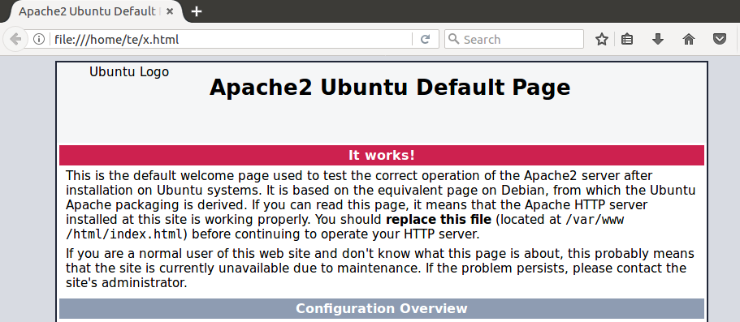

#### Apache

In this section, we'll look at using Apache as a web-server in Ubuntu.

Let's start with

- ``sudo apt-get install curl``
- ``sudo apt-get install apache2``

Starting and stopping the server can be done with any of these (so far as I know):

- ``sudo /etc/init.d/apache2 restart``
- ``sudo apache2ctl restart``
- ``sudo service apache2 restart``

#### First, stop nginx

So let's do

```
$ sudo apache2ctl restart
```

There's an issue.  At first I thought it was due to the firewall ``ufw``.  Try ``sudo ufw allow 80``.

Nope.  

Following [this](https://askubuntu.com/questions/256013/apache-error-could-not-reliably-determine-the-servers-fully-qualified-domain-n)

```
$ echo "ServerName localhost" | sudo tee /etc/apache2/conf-available/fqdn.conf
sudo a2enconf fqdn
```

Then 

```
service apache2 restart
service apache2 reload
```

Neither works.

The problem is that ``nginx`` is already running!

```
sudo netstat -tulpn | grep :80
tcp        0      0 0.0.0.0:80              0.0.0.0:*               LISTEN      901/nginx -g daemon
tcp6       0      0 :::80                   :::*                    LISTEN      901/nginx -g daemon
```

So stop it!

```
$ sudo service nginx stop
$ sudo service apache2 start
$ curl localhost > x.html
```

Open in Firefox:



That looks promising.

Next, I'd like to configure Apache to serve scripts.

Here are some [docs](http://httpd.apache.org/docs/current/howto/cgi.html)

Every time I've gone through this before, I've done a change of setting (with Ubuntu powered down).  On the host:

```
VBoxManage modifyvm Ubuntu --natpf1 "server,tcp,,8080,,8080"
```

This tells VirtualBox to do *Network Address Translation* or NAT.  But it is not necessary to get the basic server to work.  So don't do that yet.

#### Get cgi working

The directory ``/etc/apache2`` has two sub-directories ``conf-enabled`` and ``conf-available`` as well as ``mods-enabled`` and ``mods-available``.  When it is desired to activate a particular configuration, it is sym-linked into ``x.enabled`` from ``x.available``.

From [here](https://askubuntu.com/questions/403067/cgi-bin-not-working) I get that ``a2enmod`` is a thing.  From the man page

>    a2enmod  is  a  script  that  enables  the  specified module within the
    apache2 configuration.   It  does  this  by  creating  symlinks  within
    /etc/apache2/mods-enabled.   Likewise,  a2dismod  disables  a module by
    removing those symlinks.  It is not an error to enable a  module  which
    is already enabled, or to disable one which is already disabled.

```
$ sudo a2enmod cgi
[sudo] password for te: 
Your MPM seems to be threaded. Selecting cgid instead of cgi.
Enabling module cgid.
To activate the new configuration, you need to run:
  service apache2 restart
$ sudo servoce apache2 restart
```

We get ``cgid.conf`` and ``cgid.load``.  Making progress.

#### But we need a script

Use the EOF trick:

```
$ cat << EOF > script.py
#! /usr/bin/python

print """
<HTML>
<HEAD>
<TITLE>Your Title Here</TITLE>
</HEAD>
<BODY BGCOLOR="FFFFFF">
<H1>Hello, world!</H1>
</BODY>
</HTML>

EOF
```

```
sudo cp script.py /usr/lib/cgi-bin``
```

Change the permissions:

```
sudo chmod 755 /usr/lib/cgi-bin/script.py
sudo chown `whoami` /usr/lib/cgi-bin/script.py
sudo chgrp adm /usr/lib/cgi-bin/script.py
```

```
curl localhost/cgi-bin/script.py
<HTML>
<HEAD>
<TITLE>Your Title Here</TITLE>
</HEAD>
<BODY BGCOLOR="FFFFFF">
<H1>Hello, world!</H1>
</BODY>
</HTML>

```

It works!

#### PHP

**info.php**

```
<?php
phpinfo();
?>
```
Change the permissions:

```

sudo chmod 755 /usr/lib/cgi-bin/info.php
sudo chown `whoami` /usr/lib/cgi-bin/info.php
sudo chgrp adm /usr/lib/cgi-bin/info.php
```

```
cd
curl localhost/cgi-bin/info.php > x.html
```

We get an error.  Seems to be an issue with PHP.  Not solved yet.  I didn't have php, but this doesn't work

```
sudo apt-get install php
..
sudo service apache2 restart

```

There's something called php-fastcgi...

It seems that PHP has got more complicated.

According to [this](https://www.howtoforge.com/tutorial/apache-with-php-fpm-on-ubuntu-16-04/), we need to configure Apache a bit.

These changes broke the server...

At this point I re-installed Ubuntu from scratch.  Then

```
sudo apt-get install -y apache2
sudo apt-get install -y php7.0 libapache2-mod-php7.0 php7.0-cli php7.0-common php7.0-mbstring php7.0-gd php7.0-intl php7.0-xml php7.0-mysql php7.0-mcrypt php7.0-zip
php -v
PHP 7.0.22-0ubuntu0.16.04.1 (cli) ( NTS )
Copyright (c) 1997-2017 The PHP Group
Zend Engine v3.0.0, Copyright (c) 1998-2017 Zend Technologies
    with Zend OPcache v7.0.22-0ubuntu0.16.04.1, Copyright (c) 1999-2017, by Zend Technologies
te@te-VirtualBox:~$

```

Now do

```
curl localhost/cgi-bin/info.php
The program 'curl' is currently not installed. You can install it by typing:
sudo apt install curl
te@te-VirtualBox:~$ sudo apt-get install curl
..
te@te-VirtualBox:~$ curl localhost/cgi-bin/info.php
<!DOCTYPE HTML PUBLIC "-//IETF//DTD HTML 2.0//EN">
<html><head>
<title>404 Not Found</title>
</head><body>
<h1>Not Found</h1>
<p>The requested URL /cgi-bin/info.php was not found on this server.</p>
<hr>
<address>Apache/2.4.18 (Ubuntu) Server at localhost Port 80</address>
</body></html>
te@te-VirtualBox:~$
```

Yes, I wiped the disk.

```
cat << EOF > info.php
<?php
phpinfo();
?>
EOF
```

```
sudo cp info.php /usr/lib/cgi-bin``
sudo chmod 755 /usr/lib/cgi-bin/info.php
sudo chown `whoami` /usr/lib/cgi-bin/info.php
sudo chgrp adm /usr/lib/cgi-bin/info.php
curl localhost/cgi-bin/info.php
```

Doesn't work


