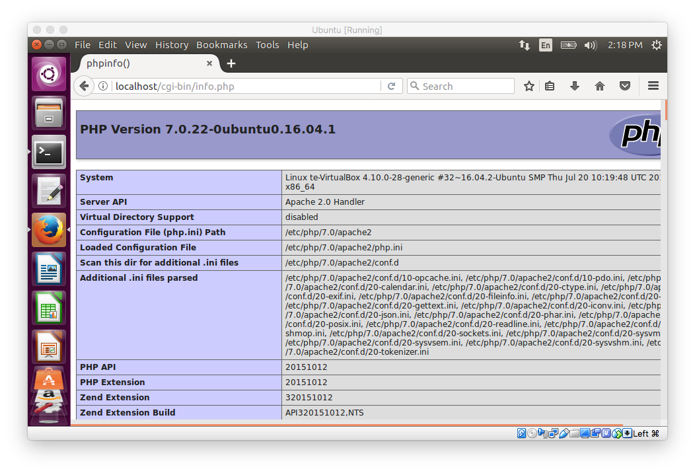

#### Apache

In this section, we'll look at using Apache as a web-server in Ubuntu.  To be sure we know how things work, I re-install Ubuntu (without the GuestAdditions).

Let's start with

- ``sudo apt-get install curl``
- ``sudo apt-get install apache2``

On one run-through, Apache would not run because something else was already:  ``nginx`.

Check for this with ``netstat`` ([notes](http://www.adminschoice.com/netstat-10-most-common-usage-with-examples)).

[link](https://askubuntu.com/questions/256013/apache-error-could-not-reliably-determine-the-servers-fully-qualified-domain-n)

```
sudo netstat -tulpn | grep :80
```

When there was a problem, I got

```
sudo netstat -tulpn | grep :80
tcp        0      0 0.0.0.0:80              0.0.0.0:*               LISTEN      901/nginx -g daemon
tcp6       0      0 :::80                   :::*                    LISTEN      901/nginx -g daemon
```

However, this doesn't usually happen.  So maybe I tried ``nginx`` first and just forgot.

Starting and stopping the server can be done with any of these (so far as I know):

- ``sudo /etc/init.d/apache2 restart``
- ``sudo apache2ctl restart``
- ``sudo service apache2 restart``

I usually do

```sudo service apache2 restart```

Open in Firefox:


That looks promising.

Next, I'd like to configure Apache to serve scripts.

Apache [docs](https://httpd.apache.org/docs/2.4/howto/cgi.html).

#### Serve html

The docs say, whatever your script returns, it must be html, and it must be preceeded by ``Content-type..``.

We'll use Python.

**test**

```
#! /usr/bin/python

print """
<!DOCTYPE html>
  <HTML lang="en">
    <HEAD>
      <meta Content-Type: text/html; charset="utf-8" />
      <TITLE>Your Title Here</TITLE>
    </HEAD>
    <BODY BGCOLOR="0000FF">
      <H1>Hello, world!</H1>
    </BODY>
  </HTML>
```

I type this into TextEditor in a file on my Desktop.

#### Permissions

according to the [docs](https://httpd.apache.org/docs/2.4/howto/cgi.html)

>    when the server starts up, it is running with the permissions of an unprivileged user - usually nobody, or www - and so it will need extra permissions to execute files that are owned by you. Usually, the way to give a file sufficient permissions to be executed by nobody is to give everyone execute permission on the file

You do not need to ``chown`` or ``chgrp``.  You only need to make sure that the ``world`` has execute permissions.

```
sudo chmod 755 test.py
```

or ``chmod a+x``.

#### Directory

Next, we need to get the file in the right place.  The docs say the default is to serve from

>    should be served from the directory /usr/local/apache2/cgi-bin/

However, Ubuntu is not saving apache2 to ``/usr/local``.

My initial (successful) attempts used ``/usr/lib/cgi-bin``, which I guess I got from previous attempts or from the web, I don't remember.  It's got a lot of other stuff, but OK.

```
curl localhost/cgi-bin/test.py
```

gives an error, and the log (in ``var/log/apache2/error.log`` is not informative).

#### Get cgi working

The directory ``/etc/apache2`` has (among others) two sub-directories 

```
conf-available
conf-enabled
``` 

as well as 

```
mods-available
mods-enabled
```

When it is desired to activate a particular configuration, the appropriate file(s) are sym-linked into ``x.enabled`` from ``x.available``.  We should have something like ``cgi..`` in there, but we do not.

From [here](https://askubuntu.com/questions/403067/cgi-bin-not-working) I get that ``a2enmod`` is a thing.  From the man page

>    a2enmod  is  a  script  that  enables  the  specified module within the
    apache2 configuration.   It  does  this  by  creating  symlinks  within
    /etc/apache2/mods-enabled.   Likewise,  a2dismod  disables  a module by
    removing those symlinks.  It is not an error to enable a  module  which
    is already enabled, or to disable one which is already disabled.

```
$ sudo a2enmod cgi
[sudo] password for te: 
Your MPM seems to be threaded. Selecting cgid instead of cgi.
Enabling module cgid.
To activate the new configuration, you need to run:
  service apache2 restart
$ sudo servoce apache2 restart
```

We now have ``cgid.conf`` and ``cgid.load`` in ``/etc/apache2/mods-enabled``.

Let's try again:

```
curl localhost/cgi-bin/test.py
Content-type: text/html
..
```

Success!  So this part is necessary.

- the script must be world-executable
- it must be in a specified place
- we must enable cgi

Firefox had some trouble with my original test.

It doesn't want to display the html but wants to save the file somewhere.  It turns out there are two issues.  Apparently it automatically responds to a ``.py`` extension and tries to save the content as text.  So that's why I left it off.

Also, it doesn't like

```
Content-Type: text/html
```

in the first line, it just displays that as text on the page.

Nevertheless, it's clear that we have a Python script working.

#### How about PHP?

Here is a simple PHP script:

**info.php**

```
<?php
phpinfo();
?>
```
Change the permissions:

```
$ sudo chmod a+x info.php
$ sudo cp info.php /usr/lib/cgi-bin/info.php
```

We get an error.  

```
$ tail /var/log/apache2/error.log
..
End of script output before headers: info.php
```

according to the [docs](https://httpd.apache.org/docs/2.4/howto/cgi.html)

Seems to be an issue with PHP, because the script won't execute from the command line.

#### Notes on a LAMP stack

[here](https://www.digitalocean.com/community/tutorials/how-to-install-linux-apache-mysql-php-lamp-stack-on-ubuntu-16-04)

are what look like good notes to read on installing such a stack, including PHP.  It's pretty clear that it doesn't come installed, as Python did.

```
$ sudo apt-get install php libapache2-mod-php
$ sudo service apache2 restart
$ curl localhost/cgi-bin/info.php
```

And it works.



