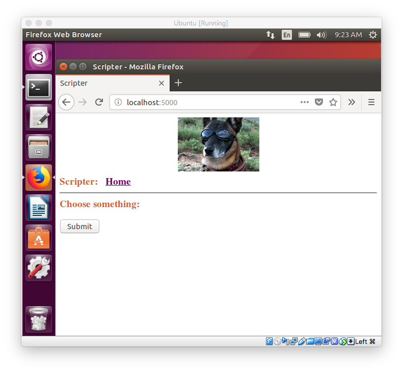

#### Flask

I have a Flask web-app skeleton project [here](https://github.com/telliott99/flask_app/blob/master/flask.md), which I developed on macOS.

In my VM on Ubuntu, all I need is to first get ``git`` and ``pip`` and then ``flask``

```
sudo apt-get install git
sudo apt-get install python-pip
pip install flask
```

Clone it and run:

```
cd
git clone https://github.com/telliott99/flask_app.git
cd flask_app/
python run.py
 * Running on http://127.0.0.1:5000/ (Press CTRL+C to quit)
 * Restarting with stat
 * Debugger is active!
 * Debugger PIN: 309-782-270
```
It works!  Point Firefox at ``localhost:5000``:




