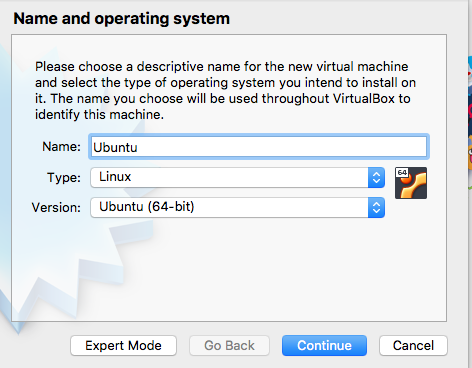
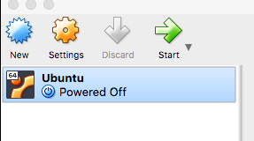
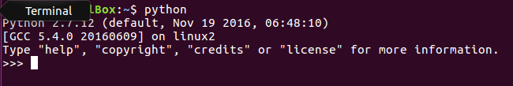

### Install Ubuntu

#### start Virtual Box

- Launch the app
- press New
- name the VM, mine is "Ubuntu"



- memory size 2048 MB
- Create a virtual HD (default)
- VDI (default)
- dynamically allocated (default)
- 10 GB (default)

Ready to start Ubuntu.

- Start



As I do this I am concerned about the dead mouse problem.  I installed Ubuntu in VB numerous times and each time I struggled with the mouse not working in the Ubuntu window.  

Eventually, this is fixed by installing what is called the VBoxGuestAdditions in Linux.  [Update:  I did not encounter any problems with the mouse this time around.] 

VB prompts for a *virtual optical disk file*.  Navigate to the file we downloaded earlier.

```
ubuntu-16.04.3-desktop-amd64.iso
```

Tell LittleSnitch to relax (allow VB to connect to a few places)

- Install Ubuntu
- download updates
- Erase disk
- write changes to disk
- time zone NYC
- English keyboard
- computer name:  te-VirtualBox
- (login auto)

Now just wait.

Resist the urge to navigate, and do not click skip, just wait until the install finishes.

- Restart Now

Resist the urge to follow the instructions to "remove the disk".

- Enter

There is a banner about ``Auto capture keyboard``.  For now, just dismiss it.

- CTL-OPT-T to bring up the Terminal.
- CTL-click on the Terminal icon in the Launcher
- lock to Launcher.

Drag the icon out on the Desktop and then reinsert it near the top.  While we're at it, remove Amazon.

Python is there.



- CTL-L to clear the Terminal.

Permissions are weird on ``/usr/local`` so:

- ``sudo chown `whoami` -R /usr/local``
- ``sudo chmod 755 -R /usr/local``
- ``sudo chgrp adm -R /usr/local``


#### Guest additions

The mouse works fine without Guest Additions (unlike in years past).  

But to get a shared folder I should need them.

The file

```
VBoxGuestAdditions.iso
```
 
is inside the App.  CTL-click as usual to navigate inside and then drag a copy of the ``iso`` to the host Desktop.

Mount the disk image from within the guest OS.  It is the second icon in the bottom toolbar.  If it doesn't run automatically, unmount and remount and it should work.  You may need to authenticate.


