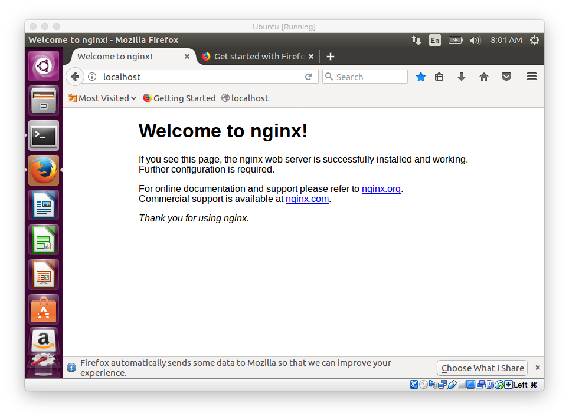
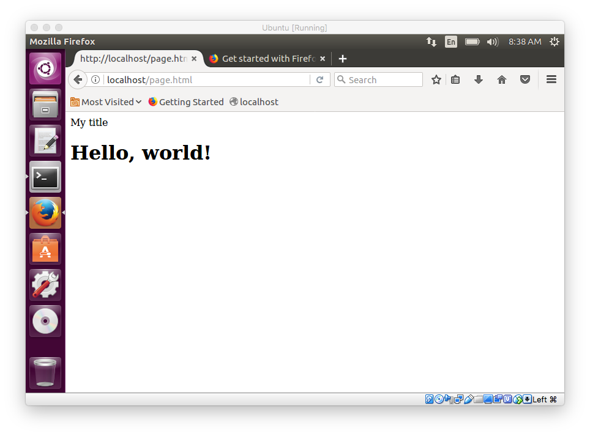

#### nginx basics

Another popular server that people are using, at least on Linux systems, is [nginx](http://nginx.org/en/).

Digital Ocean [tutorial](https://www.digitalocean.com/community/tutorials/how-to-install-nginx-on-ubuntu-16-04)

#### overview

[Here](https://www.digitalocean.com/community/tutorials/apache-vs-nginx-practical-considerations) is an overview to compare Apache and nginx.

#### ufw

The tutorial talks about configuring ``ufw``.  I had not set up the firewall for this install of Ubuntu.

If I had, we should do

```
$ sudo ufw app list
Available applications:
  Nginx Full
  Nginx HTTP
  Nginx HTTPS
  OpenSSH
```

As it is, 

```
$ sudo ufw status
Status: inactive
```

Later, I try:

```
sudo ufw enable
sudo ufw allow 'Nginx HTTP'
```

```
$ sudo ufw status
Status: active

To                         Action      From
--                         ------      ----
Nginx HTTP                 ALLOW       Anywhere                  
Nginx HTTP (v6)            ALLOW       Anywhere (v6)             

```


#### install

We start with a fresh install of Ubuntu and then get ``curl`` and ``nginx``.

```
$ sudo apt-get install curl
$ sudo apt-get update
$ sudo apt-get install nginx
```

Notice that ``localhost`` has woken up.

```
$ nc 127.0.0.1 < /dev/null; ech $?
..
1
$ curl 127.0.0.1
..
Welcome to nginx
...
```




It appears that just installing nginx also started it.  (I checked before the install and got nothing from localhost).

```
$ ps aux | grep "nginx"
..
nginx: master process
..
```

>    By default, Nginx is configured to start automatically when the server boots. If this is not what you want, you can disable this behavior by typing:

```
$ sudo systemctl disable nginx
```

#### Pages

My notes say that the default *server block* directives specify to serve documents from ``/usr/share/nginx/html``, but this isn't correct, we should use ``/var/www/html`` --- see below.

I make a generic html doc 

```
<!DOCTYPE html>
<html>
<head>
<title>My title</title>
</head>
<body>
<H1>Hello, world!</H1>
</body>
</html>
```

and copy it to ``/usr/share/nginx/html``.  Check the permissions:  the world can read it.  But curl and Firefox both give a 404.

Configuration files are in ``/etc/nginx``.

```
te@te-VirtualBox:/etc/nginx/sites-enabled$ cat default
##
# You should look at the following URL's in order to grasp a solid understanding
# of Nginx configuration files in order to fully unleash the power of Nginx.
..
root /var/www/html;
```

So that's informative.  The "document root" is ``/var/www/html``.

```
$ sudo cp page.html /var/www/html
$ sudo service nginx restart

```

The restart shouldn't be necessary, but that's what I did.

```
$ curl localhost/page.html
<!DOCTYPE html>
<html>
<head>
My title
</head>
<body>
<H1>
Hello, world!
</H1>
</body>
</html>
```



#### Scripts

Following [this tutorial](https://www.digitalocean.com/community/tutorials/how-to-set-up-uwsgi-and-nginx-to-serve-python-apps-on-ubuntu-14-04).

```
sudo apt-get install python-dev python-pip
```

The tutorial uses ``virtualenv``.  I will skip that part here.

```
$ pip install uwsgi
$ uwsgi --version
2.0.15
```

``mkdir myapp`` in my home directory and then type this in Text Editor

**wsgi.py**

```
def application(environ, start_response):
    start_response('200 OK', [('Content-Type', 'text/html')])
    return ["<h1 style='color:blue'>Hello There!</h1>"]
```

No execute permission necessary.  Then in Terminal do:

```
uwsgi --socket 0.0.0.0:8080 --protocol=http -w wsgi
```

``uwsgi`` takes care of everything.  Start another Terminal window 

```
$ curl localhost:8080
<h1 style='color:blue'>Hello There!</h1>
```


