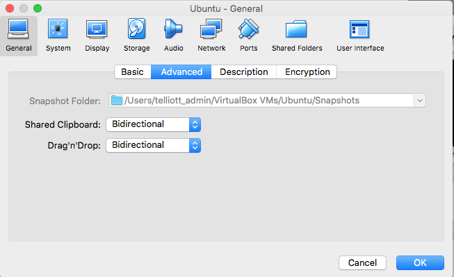
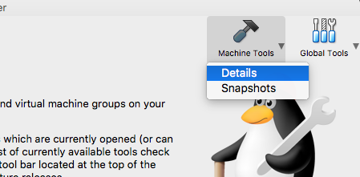
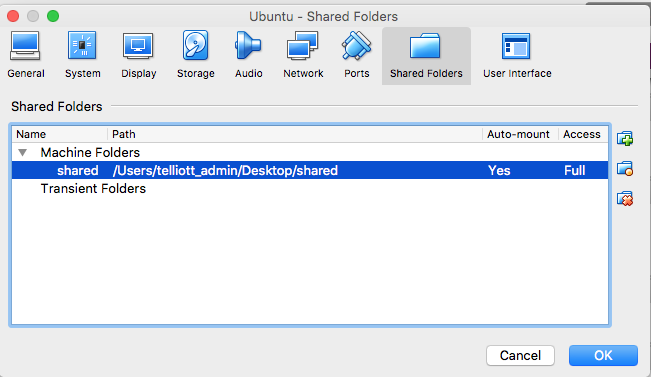
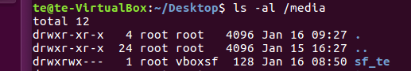
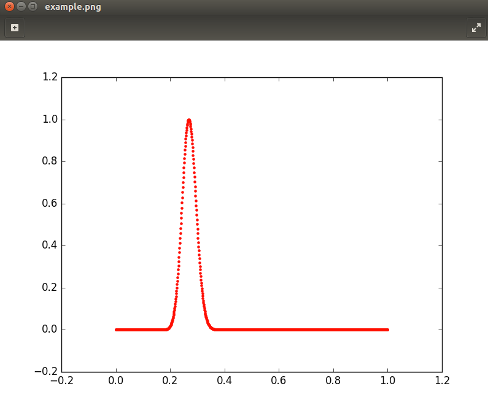

### Sharing data
A general problem is how to share data between the host and the guest OS.

I can think of several possibities

- copy/paste
- drag and drop
- shared folder
- Dropbox
- ssh
- File sharing

#### Copy/paste



In the VirtualBox window, select Ubuntu

Machine Tools > Details



then under General > Advanced are two dropdowns to activate the Clipboard and Drag'n'Drop.

The Clipboard may not work at first.  Try Powering the machine off and on.

Remember that in Ubuntu, you do ``CTL + v`` to copy, etc., rather than ``CMD + v`` as on macOS.

**Except** you do ``CTL-SHIFT-v`` when in Terminal!!

#### Drag'n'Drop

Drag'n'Drop doesn't seem to work.

#### Shared folder

Once the GuestAdditions have been installed click on the Virtual Box window.

As before, do 

```
Machine Tools > Details
```

Click on Shared Folders and then Click +

Enter the full path or navigate to it.  The folder must already exist.  I chose Automount and Full access.



The folder should be found on the guest in ``/media/sf_te``, where ``te`` was the folder name on the host Desktop.

It wasn't there the first time through.  Quit and restart Ubuntu...

It's there.

#### shared folder permissions

The only problem is that ``/media`` and ``/media/sf_te`` are owned by root.  I can't even list the ``sf_te`` directory contents!



However, I note that the group for ``sf_te`` is ``vboxsf``.  

So I added myself to that group:

```
sudo adduser te vboxsf
```

Quit and restart Ubuntu...

As a test I install ``matplotlib``.  In Terminal

```
sudo apt-get update
sudo apt-get install python-matplotlib
```

I get one of my scripts from [here](https://gist.github.com/telliott99/74bb7a47adb692b60fcbf00dd9829901).

Copy the link and paste it into Firefox (in the Guest).  Click "raw" and copy it into TextEditor and save as ``script.py``.  Run ``python script.py`` and it generates ``example.png``, which opens with ImageViewer.



Do 

```
cd /media/sf_te
cp ~/Desktop/example.png .
```
and it shows up in the host folder ``te``.

It works!


